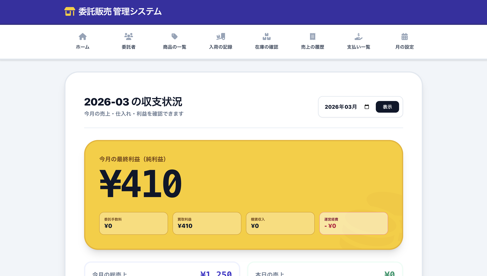
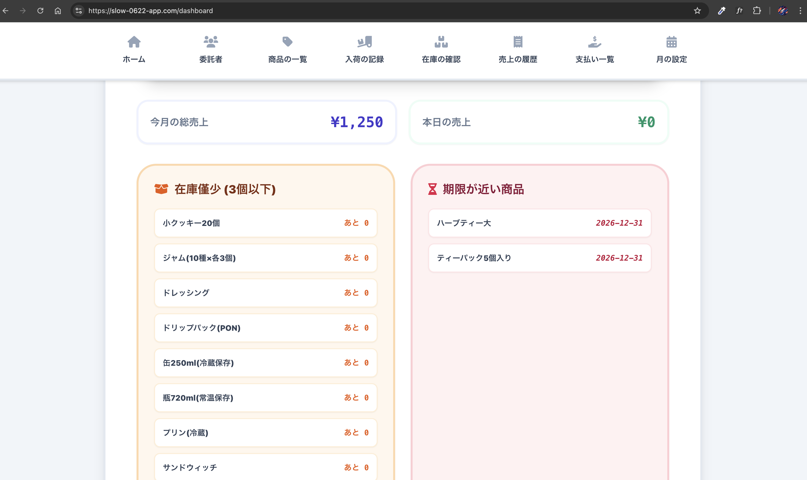
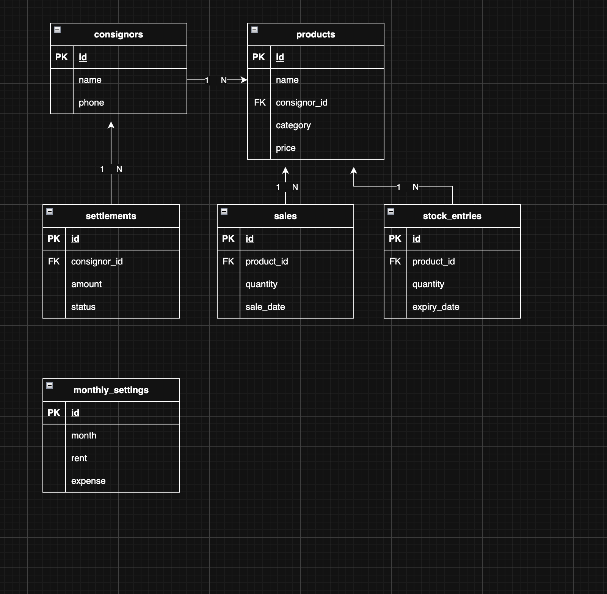
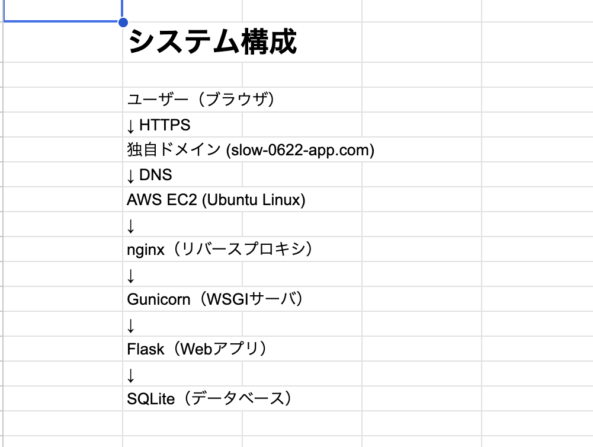

# 委託販売管理システム

## ■ 概要

本システムは、委託販売における商品管理・在庫管理・売上管理を効率化することを目的として開発したWebアプリケーションです。  
商品登録、入荷管理、売上管理、在庫計算、期限管理、精算管理を一元管理できるシステムを構築しました。

URL  
https://slow-0622-app.com

ログイン情報  
ID: itaku  
PASS: itaku2026

---

## ■ 開発目的

委託販売では以下の課題があります。

- 商品数が増えると管理が大変
- 売上計算が手作業になる
- 在庫状況が分かりにくい
- 期限管理が難しい

これらを解決するため、

- 商品
- 入荷
- 売上
- 在庫
- 精算

を一元管理できるシステムを開発しました。

---

## ■ 使用技術

### フロントエンド
- HTML
- CSS
- JavaScript
- Tailwind CSS

### バックエンド
- Python
- Flask

### データベース
- SQLite

### インフラ
- AWS EC2 (Ubuntu)
- nginx
- Gunicorn
- systemd
- Let's Encrypt
- 独自ドメイン

### バージョン管理
- Git
- GitHub

### 開発環境
- Visual Studio Code
- Google Chrome

---

## ■ 機能一覧

- ログイン / ログアウト
- ダッシュボード表示
- 月次管理
- 委託者管理
- 商品管理
- 入荷管理
- 売上管理
- 在庫一覧
- 期限管理
- 精算管理

---

## ■ 画面構成

/login  
↓  
/dashboard  

- /monthly
- /consignors
- /products
- /stock_entries
- /sales
- /stocks
- /expiry
- /settlements

---

## ■ システム構成

Browser  
↓ HTTPS  
Domain (slow-0622-app.com)  
↓  
AWS EC2 (Ubuntu)  
↓  
nginx  
↓  
Gunicorn  
↓  
Flask  
↓  
SQLite

---

## ■ データベース設計

### テーブル

- consignors
- products
- stock_entries
- sales
- settlements
- monthly_settings

### 在庫計算

在庫 = 入荷 − 売上

SQLイメージ

SUM(stock_entries.quantity) - SUM(sales.quantity)

---

## 画面

## ER図

## システム構成図

